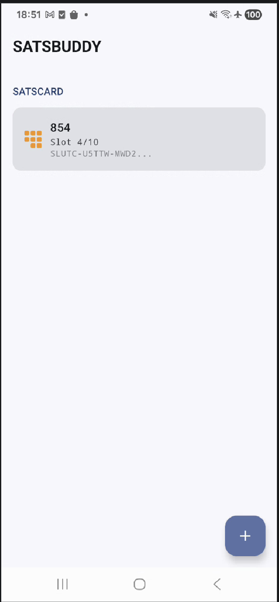
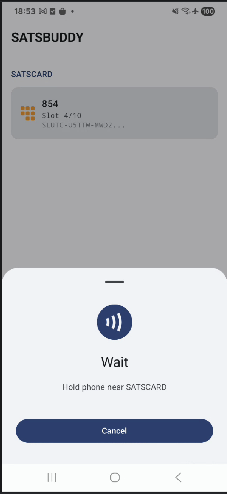
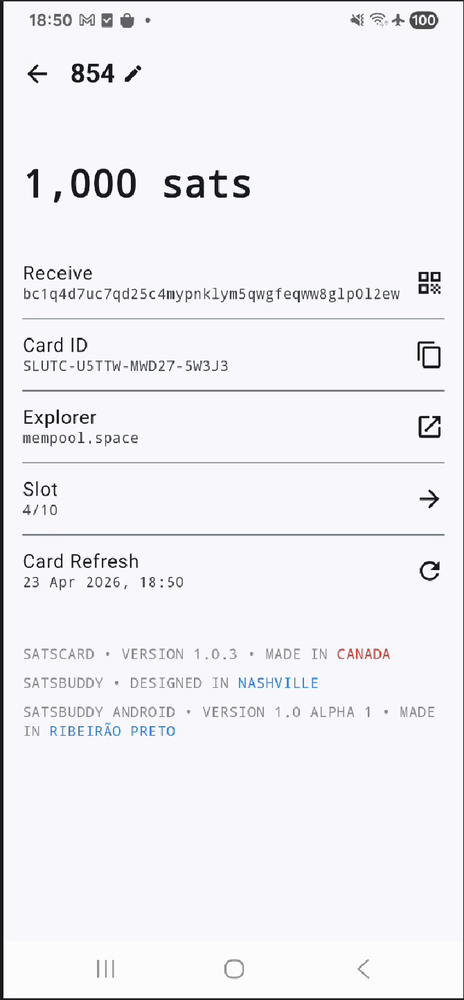
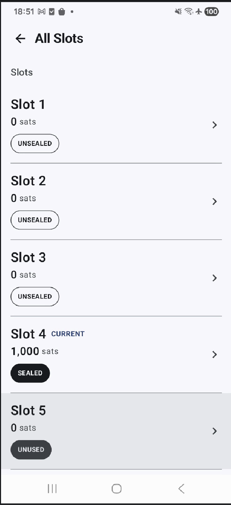

# SatsBuddy Android

Android companion app for the [Coinkite SATSCARD](https://satscard.com) — a physical Bitcoin bearer card that uses NFC to store and transfer funds slot by slot.

This project is the Android port of [SatsBuddy for iOS](https://github.com/reez/SatsBuddy) by [@reez](https://github.com/reez).

---

## What is SATSCARD?

[SATSCARD](https://satscard.com) is a product by [Coinkite](https://coinkite.com) — a physical NFC card that holds Bitcoin. Each card has up to 10 slots, each with its own private key. You load a slot with Bitcoin, hand the card to someone, and they tap it to sweep the funds. No app pairing, no Bluetooth, no battery — just NFC.

SatsBuddy lets you manage your SATSCARDs: scan them, view balances, receive Bitcoin, and sweep funds to any address.

---

## Screenshots

<p align="center">
  
  
  
  
</p>

---

## Architecture

The project follows **Clean Architecture** with the **MVVM** pattern, structured in three layers:

```
presentation/   →   Jetpack Compose screens + ViewModels
domain/         →   Use cases + repository interfaces (no Android deps)
data/           →   Repository implementations + data sources
```

### Presentation
- **Jetpack Compose** with Material3
- One `UiState` data class per screen, exposed via `StateFlow`
- `@HiltViewModel` for ViewModel injection
- **Type-safe Navigation** (Navigation Compose 2.8) using `@Serializable` route destinations

### Domain
- Pure Kotlin, zero Android dependencies
- Use cases encapsulate all business logic (`BuildPsbtUseCase`, `SignAndBroadcastUseCase`, `GetFeesUseCase`, etc.)
- Results wrapped in `kotlin.Result<T>`
- Typed error hierarchy via `AppError` sealed class (`IncorrectCvc`, `WrongCard`, `InsufficientFunds`, etc.)

### Data

| Source | Technology |
|---|---|
| Remote API | Retrofit + OkHttp + Kotlinx Serialization → [Mempool.space](https://mempool.space) |
| Local storage | Jetpack DataStore + [Google Tink](https://github.com/google/tink) (AES-256-GCM, Android Keystore) |
| NFC | Android NFC API + [rust-cktap](https://github.com/coinkite/rust-cktap) (JNI, in progress) |
| Bitcoin | [Bitcoin Dev Kit (BDK)](https://bitcoindevkit.org) (in progress) |

### Dependency Injection
**Dagger Hilt** throughout — `@HiltAndroidApp`, `@HiltViewModel`, `@Binds` modules.

---

## Bitcoin Dev Kit (BDK)

Transaction building and broadcasting is powered by [Bitcoin Dev Kit](https://bitcoindevkit.org) via the `bdk-android` bindings. BDK handles PSBT construction and wallet descriptor management. Integration is currently in progress (`BdkDataSource`).

---

## Requirements

- Android 8.0+ (API 26)
- NFC-capable device
- Internet connection (Mempool.space API)

---

## `cktap-android` dependency

SatsBuddy consumes the Coinkite Tap Protocol bindings as a Maven artifact:

```kotlin
implementation("org.bitcoindevkit:cktap-android:0.1.0-SNAPSHOT")
```

[`settings.gradle.kts`](settings.gradle.kts) declares `mavenLocal()` before `mavenCentral()`, so Gradle resolves the library from `~/.m2/repository` first and falls back to Maven Central.

While `cktap-android` is not yet published on Maven Central, build and publish it locally following the instructions in the [rust-cktap/cktap-android README](https://github.com/notmandatory/rust-cktap/tree/master/cktap-android#how-to-publish-to-your-local-maven-repository).

---

## Related

- [SatsBuddy iOS](https://github.com/reez/SatsBuddy) — original iOS app by @reez
- [SATSCARD](https://satscard.com) — Coinkite's NFC Bitcoin bearer card
- [Bitcoin Dev Kit](https://bitcoindevkit.org) — Bitcoin wallet library
- [Mempool.space](https://mempool.space) — Bitcoin explorer and fee API
